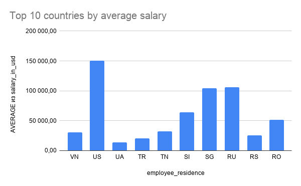
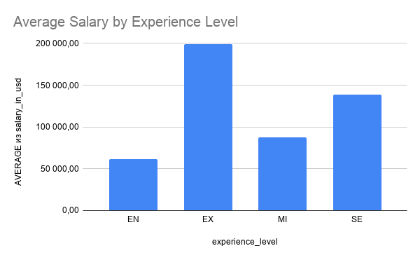
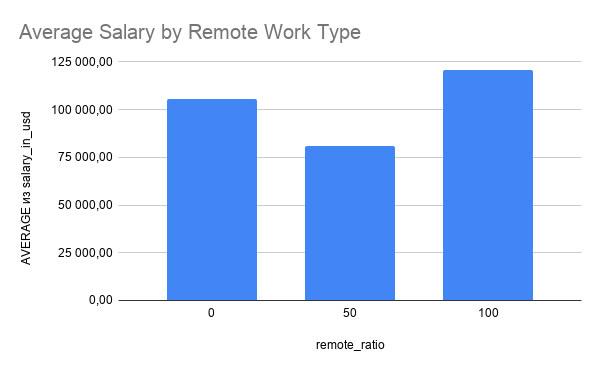
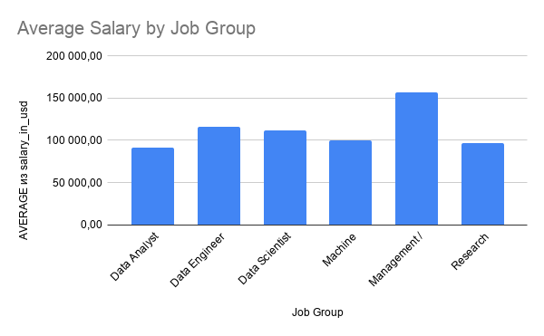

# Глобальные тренды зарплат в профессиях Data и AI: страны, опыт и формат удалённой работы

## Описание проекта
Этот проект посвящён анализу различий в зарплатах специалистов в сфере Data и AI в зависимости от страны, уровня опыта, формата работы и профессиональных групп. Анализ выполнен на основе датасета `ds_salaries.csv` и направлен на выявление ключевых закономерностей в оплате труда на глобальном рынке data- и AI-профессий.

## Актуальность
Рынок Data и AI-профессий активно развивается по всему миру. На фоне роста спроса на специалистов важно понимать, как различаются зарплаты между странами, уровнями опыта и форматами занятости. Такой анализ помогает лучше увидеть структуру глобального рынка труда в этой сфере.

## Исследовательские вопросы
- Как различаются зарплаты data- и AI-специалистов по странам?
- Как уровень опыта влияет на зарплату?
- Как формат удалённой работы связан с уровнем зарплаты?
- Какие профессиональные группы являются наиболее высокооплачиваемыми?

## Данные
В проекте используется датасет `ds_salaries.csv`. Данные были очищены в Google Sheets: удалены лишние столбцы, проверены дубликаты, а названия профессий были объединены в более крупные категории для анализа.

## Методы анализа
В ходе работы были использованы:
- очистка данных;
- сводные таблицы;
- расчёт средней, медианной, минимальной и максимальной зарплаты;
- визуализация средней зарплаты по странам, уровню опыта, формату работы и профессиональным группам.

## Основные результаты
- Средний уровень зарплат заметно различается между странами.
- Зарплата растёт вместе с уровнем опыта.
- Формат удалённой работы связан с различиями в оплате труда.
- Наиболее высокие средние зарплаты наблюдаются у management / leadership ролей.

## Визуализации

### Средняя зарплата по странам

### Средняя зарплата по уровню опыта

### Средняя зарплата по формату работы

### Средняя зарплата по профессиональным группам

## Структура репозитория
- `data/` — исходные и очищенные данные
- `visualizations/` — графики проекта
- `README.md` — описание проекта

## Инструменты
- Google Sheets
- GitHub
